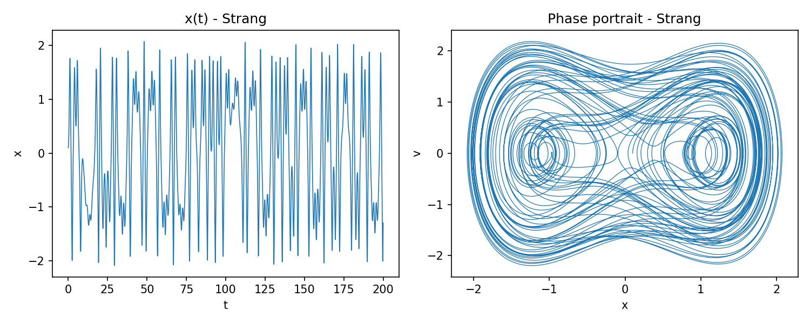
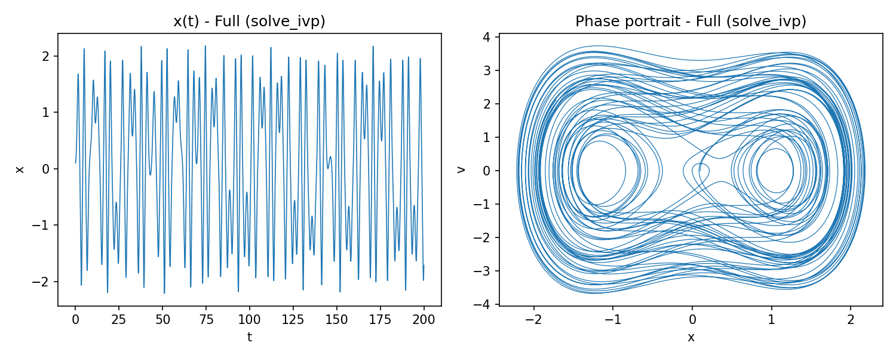
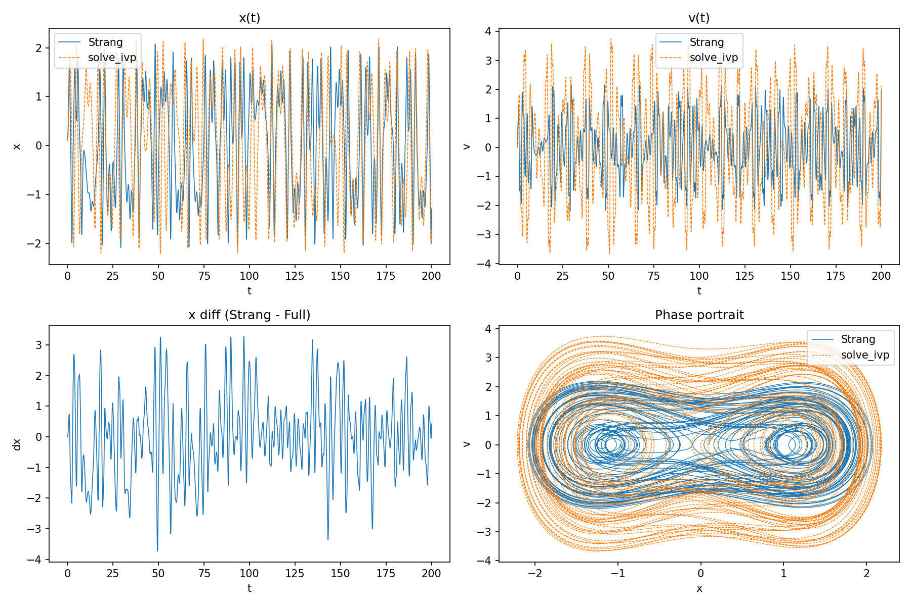

# hundunnew 🧭⚙️

受驱阻尼摆的两种数值积分方案与对比分析。

## ✨ 项目简介
- 实现两种常用数值方法，并在相同时间网格上进行对比，支持图形化展示：
  - `strang/`：Strang 分裂（L(h/2) → N(h) → L(h/2)）。N 用 Velocity-Verlet（辛），L 用 `solve_ivp` 的 RK45。
  - `full/`：传统全方程数值解（`solve_ivp` 或 `odeint`）。
  - `compare/`：对比两方案，输出误差指标并绘制覆盖图、差异曲线和相图。

## 🧠 数学模型
- 变量：`x = θ`，`v = dθ/dt`。
- 方程：
  - `dx/dt = v`
  - `dv/dt = (m g r / J) sin x - 2 b v - (k/J) x + (k/J) θ0 cos(ω t + φ)`
- 默认参数：`J=0.0025, m=0.044279, g=9.8, r=0.1, b=0.006062, k=0.0356, θ0=0.09, ω=1.1775, φ=0`。

## 📦 目录结构
```
.
├── strang/           # Strang 分裂法（L 半步 + N 整步 + L 半步）
│   ├── core.py
│   └── main.py
├── full/             # 传统全方程求解（solve_ivp / odeint）
│   ├── core.py
│   └── main.py
├── compare/          # 对比两方案并绘图
│   └── main.py
├── REPORT.md         # 若干实验的指标与图像路径
├── README.md         # 本文档
├── LICENSE           # 许可协议（MIT）
└── .gitignore
```

## 🚀 快速开始
1) 激活虚拟环境并安装依赖：
- `source .venv/bin/activate`
- `pip install -U pip`
- `pip install numpy scipy matplotlib`

2) 运行 Strang 分裂并绘图：
- `python -m strang.main --tf 50 --h 1e-3 --plot --outdir figs`

3) 运行全方程（RK45 或 odeint）并绘图：
- `python -m full.main --tf 50 --h 1e-3 --method solve_ivp --plot --outdir figs`
- `python -m full.main --tf 50 --h 1e-3 --method odeint   --plot --outdir figs`

4) 对比两者（同一时间网格）：
- `python -m compare.main --tf 50 --h 1e-3 --full-method solve_ivp --plot --outdir figs --export compare_solveivp.npz`

## 📊 输出与图像
- 指标：在控制台输出 `|dx|_max, |dv|_max, RMS(dx), RMS(dv)`。
- 图像：生成 `x(t)` 覆盖图、`v(t)` 覆盖图、差值 `dx(t)`、相图覆盖，便于直观比较。

### 🖼️ 示例图（200s, h=5e-3, solve_ivp 对比）






## 🔧 参数建议
- 选择 `h << 2π/ω`（约 5.34）以保证精度与稳定性。
- 系统含驱动与阻尼，总能量不守恒；相图（x-v）更直观地反映长期行为。

## 📚 方法原理与证明

### 1) 数学原理说明

### 问题设定

我们考虑一个常微分方程（ODE）的初值问题：
$$\frac{d\mathbf{y}}{dt} = F(\mathbf{y}, t) = (A + B)\,\mathbf{y}, \quad \mathbf{y}(t_0) = \mathbf{y}_0$$
其中 $A$ 和 $B$ 是算子，可以代表线性或非线性的作用。在这个项目中：
- **算子 A** 对应“线性 + 耗散 + 外力驱动”部分。
- **算子 B** 对应“非线性保守（哈密顿）”部分。

### 解算子 (Solution Operator)

从时间 $t$ 演化到 $t+h$ 的精确解算子记为 $\Phi_{h}^{A+B}$：
$$\mathbf{y}(t+h) = \Phi_{h}^{A+B}(\mathbf{y}(t)) = e^{h(A+B)}\,\mathbf{y}(t)$$
同理，对于子问题 $\dot{\mathbf{y}}=A\mathbf{y}$ 与 $\dot{\mathbf{y}}=B\mathbf{y}$，它们的解算子分别为 $\Phi_{h}^{A}=e^{hA}$ 和 $\Phi_{h}^{B}=e^{hB}$。

### 算子分裂法的核心思想

直接计算 $\Phi_{h}^{A+B}$ 通常很困难。算子分裂法通过组合 $\Phi_{h}^{A}$ 与 $\Phi_{h}^{B}$ 来近似求解。

- **一阶 Lie–Trotter 分裂**：
  $$
  \Phi_h^{A+B} \approx \Phi_h^A\,\Phi_h^B
  $$
  其局部截断误差为 $O(h^2)$，全局误差为 $O(h)$。

- **二阶 Strang 分裂**：
  $$
  \Psi_h^{\mathrm{Strang}} = \Phi_{h/2}^A\,\Phi_h^B\,\Phi_{h/2}^A
  $$
  这个过程可以描述为“$A$ 演化半步 → $B$ 演化整步 → $A$ 演化半步”。其对称的结构是获得更高精度的关键。

在您的项目中，所采用的方案是：
- **$B$ 部分** (非线性保守) 使用 Velocity-Verlet (一种辛积分器) 演化一个**整步** `h`。
- **$A$ 部分** (线性耗散+外驱) 使用 `solve_ivp` 中的 RK45 方法演化一个**半步** `h/2`。
- 最终组合成 Strang 分裂格式：`L(h/2) → N(h) → L(h/2)`。

### 精度阶数证明（二阶）

**目标**：证明 Strang 分裂的局部截断误差为 $O(h^3)$，从而确保其全局误差为二阶 $O(h^2)$。

**关键工具**：Baker–Campbell–Hausdorff (BCH) 公式。对于两个非交换算子 $X$ 和 $Y$：
$$e^X e^Y = e^{Z}$$
其中 $Z$ 展开为：
$$Z = X+Y + \frac{1}{2}[X,Y] + \frac{1}{12}[X,[X,Y]] - \frac{1}{12}[Y,[X,Y]] + \cdots$$
当 $X$ 和 $Y$ 都是 $O(h)$ 时，取对数可得一个非常有用的近似：
$$\log(e^X e^Y) = X + Y + \frac{1}{2}[X,Y] + O(h^3)$$

**证明思路**：
我们将 Strang 分裂算子 $\Psi_h^{\mathrm{Strang}}=e^{\frac{h}{2}A}e^{hB}e^{\frac{h}{2}A}$ 写成单一指数 $e^Z$ 的形式，然后将其与精确解的算子 $e^{h(A+B)}$ 进行比较。

1.  **首先合并后两项**
    令 $X = hB$, $Y = \frac{h}{2}A$。根据 BCH 公式：
    $$
    \begin{align*}
    \log\left(e^{hB} e^{\frac{h}{2}A}\right) &= (hB) + \left(\frac{h}{2}A\right) + \frac{1}{2}\left[hB, \frac{h}{2}A\right] + O(h^3) \\
    &= hB + \frac{h}{2}A + \frac{h^2}{4}[B,A] + O(h^3)
    \end{align*}
    $$
    我们记此结果为算子 $C$，即 $e^C = e^{hB} e^{\frac{h}{2}A}$。

2.  **再与第一项合并**
    现在我们计算 $\Psi_h^{\mathrm{Strang}}=e^{\frac{h}{2}A} e^C$。令 $X=\frac{h}{2}A$, $Y=C$：
    $$
    \log(\Psi_h^{\mathrm{Strang}}) = \left(\frac{h}{2}A\right) + C + \frac{1}{2}\left[\frac{h}{2}A, C\right] + O(h^3)
    $$

### 3) 代入 C 并按 h 的幂次收集项

首先，将算子 $C$ 的表达式代入到 $\log(\Psi_h^{\mathrm{Strang}})$ 的公式中：
$$\log(\Psi_h^{\mathrm{Strang}}) = \frac{h}{2}A + C + \frac{1}{2}\left[\frac{h}{2}A, C\right] + O(h^3)$$
代入 $C = hB + \frac{h}{2}A + \frac{h^2}{4}[B,A] + O(h^3)$，我们得到：
$$\log(\Psi_h^{\mathrm{Strang}}) = \frac{h}{2}A + \left( hB + \frac{h}{2}A + \frac{h^2}{4}[B,A] \right) + \frac{1}{2}\left[\frac{h}{2}A, hB + \frac{h}{2}A + \dots\right] + O(h^3)$$
现在，我们按 $h$ 的幂次来整理和分析各项。

- #### $O(h)$ 阶项
  只看与 $h$ 成正比的项：
  $$
  \frac{h}{2}A + hB + \frac{h}{2}A = h(A+B)
  $$
  这与精确解算子 $e^{h(A+B)}$ 的指数中的一阶项完全一致。

- #### $O(h^2)$ 阶项
  接下来，我们收集所有与 $h^2$ 成正比的项。这些项来自两个地方：
  1.  来自 $C$ 表达式中的项：$\frac{h^2}{4}[B,A]$
  2.  来自对易子 $\frac{1}{2}\left[\frac{h}{2}A, C\right]$。我们只需考虑 $C$ 中的最低阶项（$hB$），因为其他项会产生更高阶的贡献（$O(h^3)$ 或更高）。所以，这一部分的主要贡献是：
      $$
      \frac{1}{2}\left[\frac{h}{2}A, hB\right] = \frac{h^2}{4}[A,B]
      $$
  将这两个 $O(h^2)$ 的项相加：
  $$
  \frac{h^2}{4}[B,A] + \frac{h^2}{4}[A,B]
  $$
  利用对易子的反对称性质 $[A,B] = -[B,A]$，上式变为：
  $$
  \frac{h^2}{4}(- [A,B] + [A,B]) = 0
  $$
  可见，$O(h^2)$ 阶的误差项被完全抵消了。

### 结论

由于 $O(h^2)$ 项为零，$\log(\Psi_h^{\mathrm{Strang}})$ 的展开式与 $h(A+B)$ 的差异从 $O(h^3)$ 阶才开始出现：
$$\log(\Psi_h^{\mathrm{Strang}}) = h(A+B) + O(h^3)$$
这意味着 Strang 分裂算子与精确解算子之差为 $O(h^3)$：
$$\Psi_h^{\mathrm{Strang}} = e^{h(A+B)} + O(h^3)$$
因此，该方法的**局部截断误差**为 $O(h^3)$，**全局误差**为 $O(h^2)$。证毕。


**证毕。**

### 3) 稳定性与可行性分析

#### 可行性（Feasibility）
分裂法可行性的关键在于“子问题是否更易求”：

1) $B$（非线性保守）：为哈密顿子系统，可用辛积分器（如 Velocity-Verlet）高效稳定地整步更新；
2) $A$（线性耗散+外驱）：线性系统，可解析或高效数值推进。使用 RK45 半步即可达到所需精度。

#### 稳定性（Stability）

- 继承子法稳定性：
  - $B$ 用的 Velocity-Verlet 在线性测试方程下无条件稳定，且保持辛结构，长期抑制能量虚假漂移；
  - $A$ 为阻尼型，数值上自带稳定化；在合理步长下 RK45 稳定。
- 结构保持优势：驱动+阻尼破坏保守性，但对 $B$ 使用辛方法能“记住”系统的几何结构；在弱耗散/驱动下，相比对整系统直接用常规方法，长期表现更稳健。

综上，Strang 分裂通过“对保守骨架用辛法、对耗散驱动用标准法”的搭配，实现了精度与长期稳定性的平衡，因而在计算物理/化学中被广泛采用。

## 📝 许可
- 本项目使用 MIT License，详见 `LICENSE` 文件。

## 🤝 贡献
- 欢迎提交 Issue/PR，或提出新特性建议（如解析线性半步、Poincaré 截面、批量对比报告等）。
